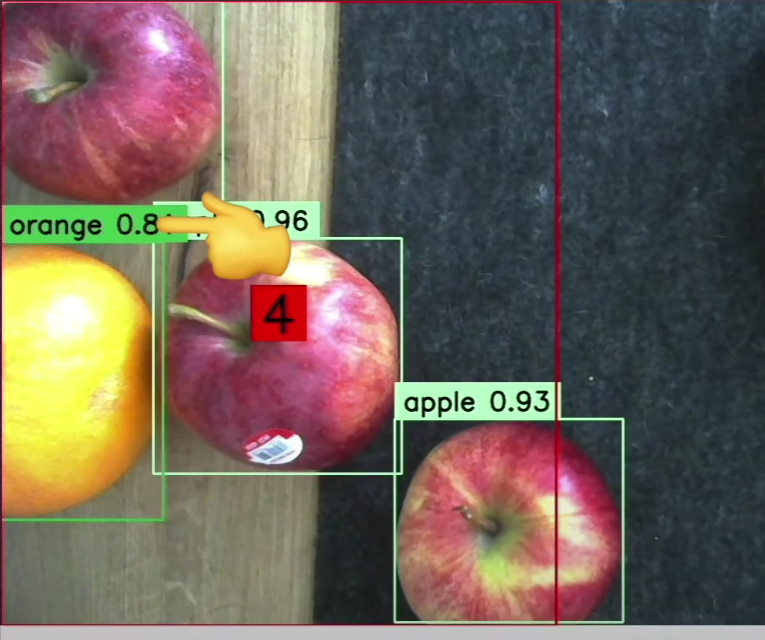
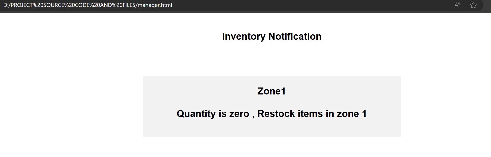
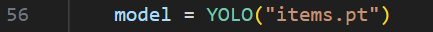
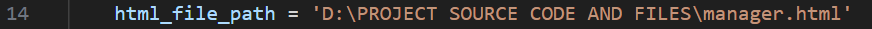

This program allows you to read item count within a specific boundary in real time , if the item count is zero for a set amount of time , a simple notification pops up in the form of a html file.

The model used here to train the data is YOLOv8. We have used a pretrained model that identifies all items, but if you need to add your own model that identifies specific items you can do so by changing "items.pt"  in line 56 within main.py. you can try so by by replacing "items.pt" using our candp.pt,candp2.pt or colddrinks.pt which identifies cold beverages.

Before running main.py be sure to install all the necessary libraries in your terminal , you can run the following commands in the termnal to install the necessary libraries. 

pip install numpy

pip install supervision

pip install ultralytics

pip install cv 

You also need to change the address to the relevant address for "manager.html"

